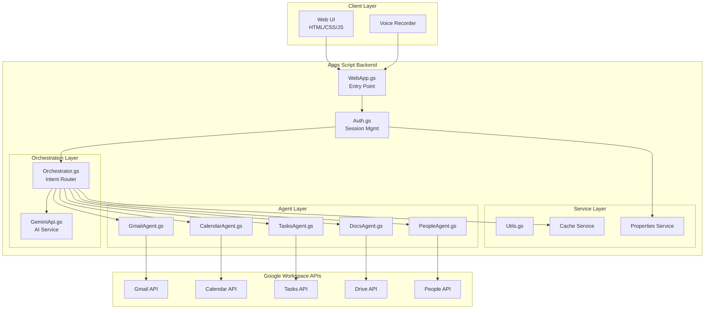
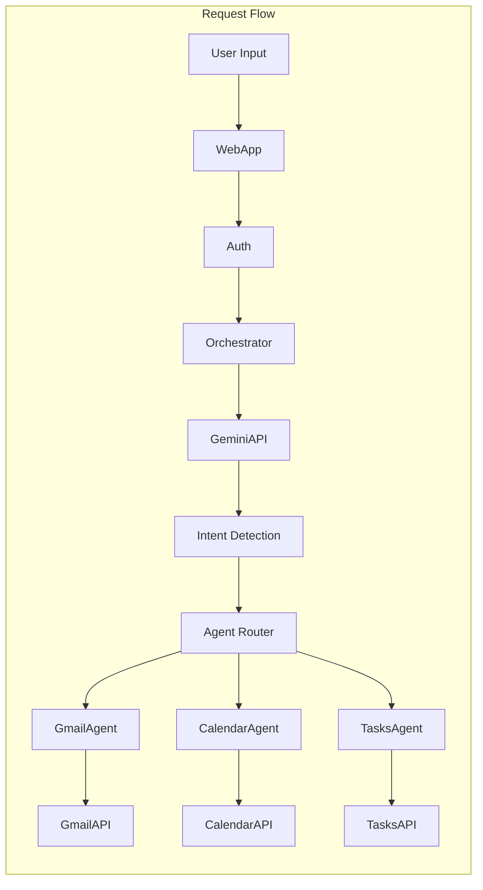
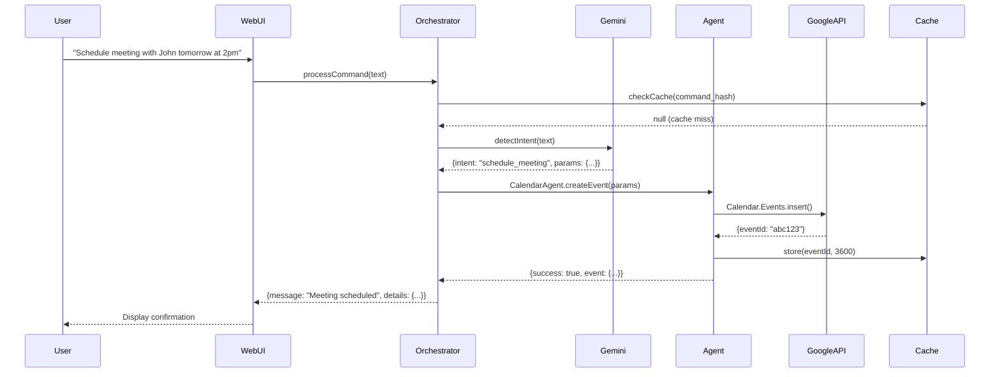

I'm now Winston, the Architect agent. I'll create a comprehensive architecture document for your Jarvis AI Assistant, focusing on the Google Apps Script constraints and optimization strategies.

Let me review your PRD and create the architecture using the BMAD architecture template.

# Jarvis AI Assistant Architecture Document

## Introduction

This document outlines the overall project architecture for Jarvis AI Assistant, including backend systems, shared services, and non-UI specific concerns. Its primary goal is to serve as the guiding architectural blueprint for AI-driven development, ensuring consistency and adherence to chosen patterns and technologies.

**Relationship to Frontend Architecture:**
Since this is a web-based application with significant UI components, a separate Frontend Architecture Document will detail the frontend-specific design and MUST be used in conjunction with this document. Core technology stack choices documented herein are definitive for the entire project, including any frontend components.

### Starter Template or Existing Project
N/A - Greenfield project using Google Apps Script platform

### Change Log
| Date | Version | Description | Author |
|------|---------|-------------|--------|
| [Today's Date] | 1.0 | Initial Architecture | Architect |

## High Level Architecture

### Technical Summary
The system employs a serverless architecture entirely within Google Apps Script, utilizing event-driven patterns for agent orchestration and API integration. The architecture leverages Google Workspace APIs for all data operations, Gemini AI for natural language processing, and Properties/Cache Services for state management. This monolithic Apps Script deployment ensures zero infrastructure overhead while maintaining modularity through a well-defined agent layer pattern, supporting the PRD goals of 78-96% time reduction in administrative tasks.

### High Level Overview
The architecture follows a **Serverless Monolith** pattern within Google Apps Script, deployed as a single web application. The **Monorepo** structure contains all agents, services, and UI components in one Apps Script project. Service architecture uses an **Agent-Based Pattern** where specialized agents handle specific Google Workspace services, orchestrated by a central coordinator. The primary user interaction flows through a web interface to the orchestrator, which routes requests to appropriate agents based on intent detection via Gemini AI.

### High Level Project Diagram



### Architectural and Design Patterns

- **Agent-Based Architecture:** Specialized agents for each Google service - *Rationale:* Enables clear separation of concerns and parallel development while maintaining single responsibility principle
- **Command Pattern:** User intents translated to executable commands - *Rationale:* Provides undo capability and command queuing for reliability
- **Repository Pattern:** Abstract Google API access through agent interfaces - *Rationale:* Simplifies testing and provides consistent error handling across all APIs
- **Circuit Breaker Pattern:** Protect against API quota exhaustion - *Rationale:* Prevents cascade failures when hitting Google API limits
- **Cache-Aside Pattern:** Selective caching for frequently accessed data - *Rationale:* Optimizes performance within Apps Script's execution time limits

## Tech Stack

### Cloud Infrastructure
- **Provider:** Google Cloud (via Apps Script)
- **Key Services:** Apps Script Runtime, Google Workspace APIs, Properties Service, Cache Service, URL Fetch Service
- **Deployment Regions:** Global (Google-managed)

### Technology Stack Table

| Category | Technology | Version | Purpose | Rationale |
|----------|------------|---------|---------|-----------|
| **Runtime** | Google Apps Script | V8 | Serverless execution environment | Zero infrastructure, native Google integration |
| **Language** | JavaScript/GAS | ES6+ | Primary development language | Required by Apps Script platform |
| **AI/NLP** | Gemini AI API | 1.5 Pro | Natural language understanding | Best-in-class NLP with function calling support |
| **Email Service** | Gmail API | v1 | Email operations | Native integration via Apps Script |
| **Calendar Service** | Calendar API | v3 | Scheduling operations | Built-in Apps Script service |
| **Task Service** | Tasks API | v1 | Task management | Native Apps Script integration |
| **Storage** | Properties Service | Built-in | Configuration and preferences | No external database needed |
| **Cache** | Cache Service | Built-in | Performance optimization | 6-hour TTL for session data |
| **Documents** | Docs API | v1 | Document creation | Native integration |
| **Contacts** | People API | v1 | Contact resolution | Built-in service |
| **Auth** | Google OAuth 2.0 | Built-in | Authentication | Automatic with Apps Script |
| **UI Framework** | Vanilla JS | ES6 | Frontend interactivity | Minimal overhead, fast loading |
| **CSS Framework** | Material Design Lite | 1.3.0 | UI styling | Google design consistency |
| **Testing** | GAS Testing Framework | Custom | Unit testing | Lightweight custom framework |
| **Logging** | Stackdriver | Built-in | Error tracking | Automatic with Apps Script |
| **IDE** | Apps Script Editor | Current | Development environment | Cloud-based development |

## Data Models

### User
**Purpose:** Store user preferences and session information

**Key Attributes:**
- email: string - User's Google account email
- preferences: object - User-specific settings
- timezone: string - User's timezone for scheduling
- workingHours: object - Start/end times for smart scheduling

**Relationships:**
- Has many Sessions
- Has many AuditLogs

### Session
**Purpose:** Manage conversation context and state

**Key Attributes:**
- sessionId: string - Unique session identifier
- userId: string - Associated user email
- startTime: timestamp - Session start
- messages: array - Conversation history
- context: object - Current conversation context

**Relationships:**
- Belongs to User
- Has many Commands

### Command
**Purpose:** Track executed commands for undo/audit

**Key Attributes:**
- commandId: string - Unique identifier
- sessionId: string - Parent session
- intent: string - Detected intent type
- parameters: object - Command parameters
- result: object - Execution result
- timestamp: timestamp - Execution time

**Relationships:**
- Belongs to Session
- May have related GoogleResource

### GoogleResource
**Purpose:** Track created/modified Google resources

**Key Attributes:**
- resourceId: string - Google resource ID
- resourceType: string - email/event/task/doc
- commandId: string - Creating command
- metadata: object - Resource-specific data

**Relationships:**
- Created by Command
- May be referenced by other Commands

## Components

### WebApp.gs
**Responsibility:** Entry point for all HTTP requests, routing, and response handling

**Key Interfaces:**
- doGet(): Serves HTML interface
- doPost(): Handles API requests
- processCommand(): Routes to orchestrator

**Dependencies:** Auth.gs, Orchestrator.gs, all HTML templates

**Technology Stack:** Apps Script runtime, HTML Service

### Auth.gs
**Responsibility:** Manage user authentication and session lifecycle

**Key Interfaces:**
- validateUser(): Verify Google account
- createSession(): Initialize user session
- checkPermissions(): Verify OAuth scopes

**Dependencies:** Properties Service

**Technology Stack:** Google OAuth 2.0, Properties Service

### Orchestrator.gs
**Responsibility:** Intent detection and agent routing

**Key Interfaces:**
- detectIntent(): Process with Gemini AI
- routeToAgent(): Dispatch to appropriate agent
- handleResponse(): Format agent responses

**Dependencies:** GeminiApi.gs, all Agent modules

**Technology Stack:** Gemini API integration

### GmailAgent.gs
**Responsibility:** All email-related operations

**Key Interfaces:**
- listEmails(): Retrieve inbox
- draftEmail(): Create drafts
- sendEmail(): Send messages
- searchEmails(): Query inbox

**Dependencies:** Gmail API, Utils.gs

**Technology Stack:** Gmail Advanced Service

### CalendarAgent.gs
**Responsibility:** Calendar and scheduling operations

**Key Interfaces:**
- getAgenda(): Retrieve events
- createEvent(): Schedule meetings
- findAvailableSlots(): Smart scheduling
- updateEvent(): Modify events

**Dependencies:** Calendar API, Utils.gs

**Technology Stack:** Calendar Advanced Service

### Component Diagrams



## External APIs

### Gemini AI API
- **Purpose:** Natural language processing and intent detection
- **Documentation:** https://ai.google.dev/api/rest
- **Base URL(s):** https://generativelanguage.googleapis.com/v1beta/
- **Authentication:** API Key
- **Rate Limits:** 60 requests per minute

**Key Endpoints Used:**
- `POST /models/gemini-pro:generateContent` - Text generation and intent detection
- `POST /models/gemini-pro-vision:generateContent` - Audio transcription (if available)

**Integration Notes:** Implement exponential backoff for rate limiting, cache common responses

### Google Workspace APIs (via Advanced Services)
- **Purpose:** Access Google Workspace data
- **Documentation:** Built into Apps Script
- **Base URL(s):** N/A (native integration)
- **Authentication:** OAuth 2.0 (automatic)
- **Rate Limits:** Various per service

**Key Services:**
- Gmail: 250 quota units per user per second
- Calendar: 500 queries per day
- Tasks: 50,000 queries per day
- People: 90 queries per minute

**Integration Notes:** Use batch operations where possible, implement caching strategy

## Core Workflows



## REST API Spec

```yaml
openapi: 3.0.0
info:
  title: Jarvis AI Assistant API
  version: 1.0.0
  description: Internal API for Apps Script Web App
servers:
  - url: https://script.google.com/macros/s/{scriptId}/exec
    description: Apps Script Web App endpoint

paths:
  /command:
    post:
      summary: Process user command
      requestBody:
        required: true
        content:
          application/json:
            schema:
              type: object
              properties:
                action: 
                  type: string
                  enum: [processCommand, getStatus, getHistory]
                text:
                  type: string
                  description: User command text
                sessionId:
                  type: string
                audio:
                  type: string
                  format: base64
                  description: Audio data for transcription
      responses:
        200:
          description: Command processed successfully
          content:
            application/json:
              schema:
                type: object
                properties:
                  success:
                    type: boolean
                  message:
                    type: string
                  data:
                    type: object
                  actions:
                    type: array
                    items:
                      type: object

  /auth:
    get:
      summary: Authenticate user
      responses:
        200:
          description: Authentication successful
          content:
            text/html:
              schema:
                type: string
```

## Database Schema

Since we're using Properties Service and Cache Service instead of a traditional database:

```javascript
// Script Properties (Global Configuration)
{
  "config": {
    "GEMINI_API_KEY": "encrypted_key",
    "DEFAULT_TIMEZONE": "America/Los_Angeles",
    "WORKING_HOURS_START": "09:00",
    "WORKING_HOURS_END": "17:00",
    "MAX_AUDIO_SIZE_MB": 25,
    "CACHE_TTL_SECONDS": 3600
  }
}

// User Properties (Per-User Storage)
{
  "user:{email}": {
    "preferences": {
      "autoSendEmails": false,
      "meetingBuffer": 15,
      "defaultMeetingDuration": 30,
      "voiceEnabled": true,
      "theme": "light"
    },
    "workingHours": {
      "monday": {"start": "09:00", "end": "17:00"},
      // ... other days
    }
  },
  "session:{sessionId}": {
    "userId": "user@company.com",
    "startTime": "ISO-8601",
    "lastActive": "ISO-8601",
    "context": {}
  }
}

// Cache Service (Temporary Storage)
{
  "intent:{hash}": {
    "intent": "schedule_meeting",
    "confidence": 0.95,
    "ttl": 3600
  },
  "calendar:{userId}:{date}": {
    "events": [...],
    "ttl": 900  // 15 minutes
  },
  "emails:{userId}:recent": {
    "messages": [...],
    "ttl": 900
  }
}
```

## Source Tree

```plaintext
jarvis-ai-assistant/
├── Code.gs files:
│   ├── WebApp.gs                 # Entry point, HTTP routing
│   ├── Auth.gs                   # Authentication & sessions
│   ├── Orchestrator.gs           # Intent detection & routing
│   ├── Agents/
│   │   ├── GmailAgent.gs         # Email operations
│   │   ├── CalendarAgent.gs      # Calendar operations
│   │   ├── TasksAgent.gs         # Task management
│   │   ├── DocsAgent.gs          # Document creation
│   │   └── PeopleAgent.gs        # Contact resolution
│   ├── Services/
│   │   ├── GeminiApi.gs          # Gemini AI integration
│   │   ├── CacheManager.gs       # Cache operations
│   │   └── PropertiesManager.gs  # Properties operations
│   ├── Utils/
│   │   ├── Utils.gs              # Common utilities
│   │   ├── DateTimeUtils.gs      # Date/time helpers
│   │   ├── ValidationUtils.gs    # Input validation
│   │   └── ErrorHandler.gs       # Error handling
│   └── Tests/
│       ├── TestRunner.gs         # Test framework
│       ├── AgentTests.gs         # Agent unit tests
│       └── IntegrationTests.gs   # Integration tests
│
├── HTML files:
│   ├── Index.html                # Main application
│   ├── Login.html                # Authentication page
│   ├── Dashboard.html            # Dashboard view
│   ├── Chat.html                 # Chat interface
│   └── Components/
│       ├── AppCss.html           # Styles
│       ├── AppJs.html            # Client JavaScript
│       └── VoiceRecorder.html   # Voice component
│
└── Configuration:
    └── appsscript.json           # Manifest with scopes
```

## Infrastructure and Deployment

### Infrastructure as Code
- **Tool:** Google Apps Script Manifest
- **Location:** `appsscript.json`
- **Approach:** Declarative configuration for permissions and runtime

### Deployment Strategy
- **Strategy:** Blue-Green deployment via Apps Script versions
- **CI/CD Platform:** GitHub Actions with clasp
- **Pipeline Configuration:** `.github/workflows/deploy.yml`

### Environments
- **Development:** Script Editor test deployments - For development and testing
- **Staging:** Versioned deployment with test users - Pre-production validation
- **Production:** Published web app deployment - Live environment for all users

### Environment Promotion Flow
```text
Development (Script Editor) 
    ↓ Test & Validate
Staging (Test Deployment) 
    ↓ User Acceptance
Production (Published Web App)
    ↓ Monitor & Rollback if needed
```

### Rollback Strategy
- **Primary Method:** Apps Script version rollback
- **Trigger Conditions:** Error rate >5%, Response time >8s
- **Recovery Time Objective:** <5 minutes

## Error Handling Strategy

### General Approach
- **Error Model:** Try-catch with graceful degradation
- **Exception Hierarchy:** Custom error classes for each agent
- **Error Propagation:** Bubble to orchestrator for user messaging

### Logging Standards
- **Library:** Console and Stackdriver (built-in)
- **Format:** JSON structured logging
- **Levels:** ERROR, WARN, INFO, DEBUG
- **Required Context:**
  - Correlation ID: `${sessionId}-${timestamp}`
  - Service Context: Agent name and method
  - User Context: Anonymized user ID

### Error Handling Patterns

#### External API Errors
- **Retry Policy:** Exponential backoff with 3 retries
- **Circuit Breaker:** Trip after 5 consecutive failures
- **Timeout Configuration:** 30s for Gemini, 10s for Google APIs
- **Error Translation:** User-friendly messages for all API errors

#### Business Logic Errors
- **Custom Exceptions:** InvalidIntent, QuotaExceeded, AuthorizationError
- **User-Facing Errors:** Clear action messages with recovery steps
- **Error Codes:** JARVIS-XXX format for support reference

#### Data Consistency
- **Transaction Strategy:** Compensating transactions for multi-step operations
- **Compensation Logic:** Undo commands for failed operations
- **Idempotency:** Command IDs prevent duplicate execution

## Coding Standards

### Core Standards
- **Languages & Runtimes:** JavaScript ES6+ on Apps Script V8 runtime
- **Style & Linting:** Google JavaScript Style Guide
- **Test Organization:** Tests in `/Tests` folder, one file per agent

### Naming Conventions
| Element | Convention | Example |
|---------|------------|---------|
| Files | PascalCase.gs | `GmailAgent.gs` |
| Functions | camelCase | `sendEmail()` |
| Constants | UPPER_SNAKE | `MAX_RETRIES` |
| Private functions | underscore suffix | `validateInput_()` |

### Critical Rules
- **Never use console.log in production code - use Logger:** All logging must go through Logger.log() for Stackdriver
- **All API responses must use standardized response wrapper:** Every agent must return `{success: boolean, data: any, error?: string}`
- **Cache all Google API calls with appropriate TTL:** Use CacheManager for all external API responses
- **Input validation on every public function:** Use ValidationUtils before processing
- **Rate limiting must be enforced at agent level:** Each agent tracks its own quota usage

### Language-Specific Guidelines

#### JavaScript/Apps Script Specifics
- **Async handling:** Use Promises consistently, no callbacks
- **Error boundaries:** Every agent method wrapped in try-catch
- **Memory management:** Clear large objects after use
- **Execution time:** Monitor 6-minute limit, implement chunking

## Test Strategy and Standards

### Testing Philosophy
- **Approach:** Test-driven development where possible
- **Coverage Goals:** 80% code coverage minimum
- **Test Pyramid:** 60% unit, 30% integration, 10% E2E

### Test Types and Organization

#### Unit Tests
- **Framework:** Custom GAS Test Framework
- **File Convention:** `{AgentName}Tests.gs`
- **Location:** `/Tests/unit/`
- **Mocking Library:** Custom mock implementations
- **Coverage Requirement:** 80% per agent

**AI Agent Requirements:**
- Generate tests for all public methods
- Cover edge cases and error conditions
- Follow AAA pattern (Arrange, Act, Assert)
- Mock all external dependencies

#### Integration Tests
- **Scope:** Agent-to-API integration
- **Location:** `/Tests/integration/`
- **Test Infrastructure:**
  - **Google APIs:** Test with development project
  - **Gemini API:** Mock responses for consistency

#### E2E Tests
- **Framework:** Manual test scripts
- **Scope:** Full user workflows
- **Environment:** Staging deployment
- **Test Data:** Dedicated test accounts

### Test Data Management
- **Strategy:** Fixture-based test data
- **Fixtures:** `/Tests/fixtures/`
- **Factories:** Test data generators for complex objects
- **Cleanup:** Automatic cleanup after test runs

### Continuous Testing
- **CI Integration:** Pre-deployment test suite
- **Performance Tests:** Response time validation
- **Security Tests:** OAuth scope validation

## Security

### Input Validation
- **Validation Library:** ValidationUtils.gs
- **Validation Location:** At API boundary in WebApp.gs
- **Required Rules:**
  - All external inputs MUST be validated
  - Validation at API boundary before processing
  - Whitelist approach preferred over blacklist

### Authentication & Authorization
- **Auth Method:** Google OAuth 2.0 with Apps Script
- **Session Management:** Properties Service with timeout
- **Required Patterns:**
  - Session validation on every request
  - Scope verification before API calls

### Secrets Management
- **Development:** Script Properties (encrypted)
- **Production:** Google Secret Manager (future)
- **Code Requirements:**
  - NEVER hardcode secrets
  - Access via configuration service only
  - No secrets in logs or error messages

### API Security
- **Rate Limiting:** Token bucket per user
- **CORS Policy:** Apps Script managed
- **Security Headers:** Content-Security-Policy set
- **HTTPS Enforcement:** Automatic with Apps Script

### Data Protection
- **Encryption at Rest:** Google-managed encryption
- **Encryption in Transit:** HTTPS only
- **PII Handling:** No PII in logs, anonymized IDs only
- **Logging Restrictions:** No passwords, tokens, or email content

### Dependency Security
- **Scanning Tool:** Manual review (limited in Apps Script)
- **Update Policy:** Quarterly review of Gemini API changes
- **Approval Process:** Architecture review for new APIs

### Security Testing
- **SAST Tool:** ESLint with security rules
- **DAST Tool:** Manual penetration testing
- **Penetration Testing:** Annual third-party review

## Checklist Results Report

[To be run after architecture review]

## Next Steps

### Frontend Architecture Mode
Since this project has significant UI components, please proceed to create the Frontend Architecture document focusing on:
- Chat interface implementation
- Voice recording integration
- Real-time updates via google.script.run
- Responsive design for mobile

### Development Preparation
1. Set up Apps Script project with proper folder structure
2. Configure appsscript.json with all required scopes
3. Implement base modules (WebApp.gs, Auth.gs)
4. Set up testing framework
5. Create development and staging deployments

---

**This architecture document provides the technical foundation for implementing the Jarvis AI Assistant within Google Apps Script constraints while maintaining modularity and performance.**

Would you like me to:
1. Run the architect checklist to validate this architecture?
2. Create any specific component details?
3. Proceed to Frontend Architecture documentation?
4. Output the complete document for saving?