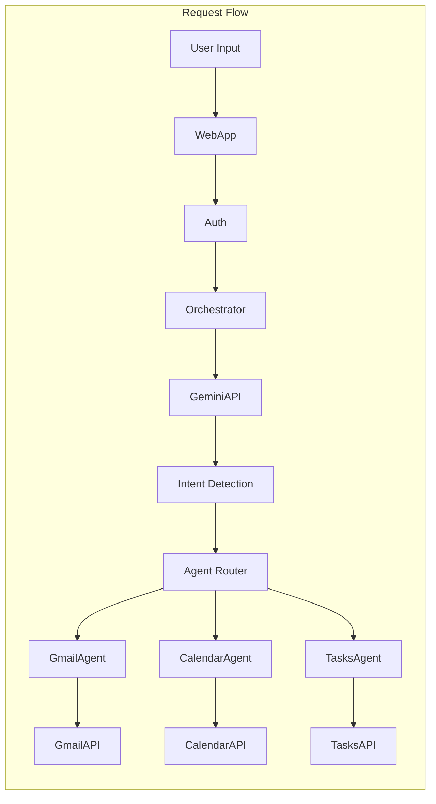

# Components

## BaseAgent.gs
**Responsibility:** Abstract base class for all agents providing common functionality

**Key Interfaces:**
- execute(): Standard execution wrapper
- validateInput(): Input validation
- handleError(): Error management
- checkQuota(): Quota verification

**Dependencies:** QuotaManager, CacheManager, Logger

**Technology Stack:** Apps Script ES6 classes

```javascript
// BaseAgent.gs - Foundation for all agents
class BaseAgent {
  constructor(name) {
    this.name = name;
    this.logger = new Logger(name);
    this.cache = new CacheManager(name);
    this.quotaManager = new QuotaManager(name);
  }
  
  async execute(command) {
    const executionId = Utilities.getUuid();
    this.logger.info(`Starting ${command.action}`, {executionId});
    
    try {
      // Input validation
      this.validateInput_(command);
      
      // Quota check
      this.quotaManager.checkQuota(command.action);
      
      // Check cache first
      const cached = this.cache.get(command);
      if (cached) {
        this.logger.info('Cache hit', {executionId});
        return this.successResponse_(cached);
      }
      
      // Execute with timeout protection
      const result = await this.executeWithTimeout_(command);
      
      // Cache successful results
      if (result.success) {
        this.cache.set(command, result);
      }
      
      return this.successResponse_(result);
      
    } catch (error) {
      this.logger.error(`Error in ${command.action}`, {
        executionId,
        error: error.toString()
      });
      return this.errorResponse_(error);
    }
  }
  
  validateInput_(command) {
    if (!command.action) {
      throw new Error('Action is required');
    }
    // Subclasses add specific validation
  }
  
  async executeWithTimeout_(command, timeout = 30000) {
    // Implementation with timeout
    return Promise.race([
      this.doExecute_(command),
      new Promise((_, reject) => 
        setTimeout(() => reject(new Error('Operation timeout')), timeout)
      )
    ]);
  }
  
  successResponse_(data) {
    return {
      success: true,
      data: data,
      timestamp: new Date().toISOString(),
      agent: this.name
    };
  }
  
  errorResponse_(error) {
    return {
      success: false,
      error: error.message,
      errorCode: this.getErrorCode_(error),
      recovery: this.getRecoverySuggestion_(error),
      timestamp: new Date().toISOString(),
      agent: this.name
    };
  }
  
  getErrorCode_(error) {
    // Map errors to codes
    const errorMap = {
      'QuotaExceeded': 'JARVIS-001',
      'InvalidInput': 'JARVIS-002',
      'AuthenticationError': 'JARVIS-003',
      'APIError': 'JARVIS-004'
    };
    return errorMap[error.constructor.name] || 'JARVIS-999';
  }
  
  getRecoverySuggestion_(error) {
    const suggestions = {
      'QuotaExceeded': 'Please wait before retrying this operation',
      'InvalidInput': 'Check your command syntax and try again',
      'AuthenticationError': 'Please re-authenticate',
      'APIError': 'The service is temporarily unavailable'
    };
    return suggestions[error.constructor.name] || 'Please try again later';
  }
}
```

## WebApp.gs
**Responsibility:** Entry point for all HTTP requests, routing, and response handling

**Key Interfaces:**
- doGet(): Serves HTML interface
- doPost(): Handles API requests
- processCommand(): Routes to orchestrator

**Dependencies:** Auth.gs, Orchestrator.gs, all HTML templates

**Technology Stack:** Apps Script runtime, HTML Service

## Auth.gs
**Responsibility:** Manage user authentication and session lifecycle

**Key Interfaces:**
- validateUser(): Verify Google account
- createSession(): Initialize user session
- checkPermissions(): Verify OAuth scopes

**Dependencies:** Properties Service

**Technology Stack:** Google OAuth 2.0, Properties Service

## Orchestrator.gs
**Responsibility:** Intent detection and agent routing

**Key Interfaces:**
- detectIntent(): Process with Gemini AI
- routeToAgent(): Dispatch to appropriate agent
- handleResponse(): Format agent responses

**Dependencies:** GeminiApi.gs, all Agent modules

**Technology Stack:** Gemini API integration

## GmailAgent.gs
**Responsibility:** All email-related operations

**Key Interfaces:**
- listEmails(): Retrieve inbox
- draftEmail(): Create drafts
- sendEmail(): Send messages
- searchEmails(): Query inbox

**Dependencies:** Gmail API, Utils.gs

**Technology Stack:** Gmail Advanced Service

## CalendarAgent.gs
**Responsibility:** Calendar and scheduling operations

**Key Interfaces:**
- getAgenda(): Retrieve events
- createEvent(): Schedule meetings
- findAvailableSlots(): Smart scheduling
- updateEvent(): Modify events

**Dependencies:** Calendar API, Utils.gs

**Technology Stack:** Calendar Advanced Service

## Component Diagrams


