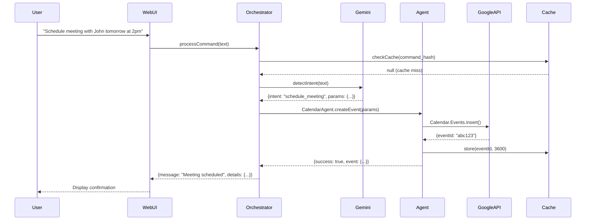

# Core Workflows

```mermaid
sequenceDiagram
    participant User
    participant WebUI
    participant Orchestrator
    participant Gemini
    participant Agent
    participant GoogleAPI
    participant Cache
    
    User->>WebUI: "Schedule meeting with John tomorrow at 2pm"
    WebUI->>Orchestrator: processCommand(text)
    Orchestrator->>Cache: checkCache(command_hash)
    Cache-->>Orchestrator: null (cache miss)
    
    Orchestrator->>Gemini: detectIntent(text)
    Gemini-->>Orchestrator: {intent: "schedule_meeting", params: {...}}
    
    Orchestrator->>Agent: CalendarAgent.createEvent(params)
    Agent->>GoogleAPI: Calendar.Events.insert()
    GoogleAPI-->>Agent: {eventId: "abc123"}
    
    Agent->>Cache: store(eventId, 3600)
    Agent-->>Orchestrator: {success: true, event: {...}}
    Orchestrator-->>WebUI: {message: "Meeting scheduled", details: {...}}
    WebUI-->>User: Display confirmation
```
