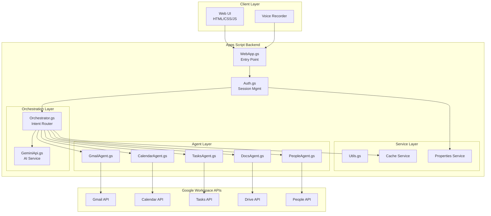

# High Level Architecture

## Technical Summary
The system employs a serverless architecture entirely within Google Apps Script, utilizing event-driven patterns for agent orchestration and API integration. The architecture leverages Google Workspace APIs for all data operations, Gemini AI for natural language processing, and Properties/Cache Services for state management. This monolithic Apps Script deployment ensures zero infrastructure overhead while maintaining modularity through a well-defined agent layer pattern, supporting the PRD goals of 78-96% time reduction in administrative tasks.

## High Level Overview
The architecture follows a **Serverless Monolith** pattern within Google Apps Script, deployed as a single web application. The **Monorepo** structure contains all agents, services, and UI components in one Apps Script project. Service architecture uses an **Agent-Based Pattern** where specialized agents handle specific Google Workspace services, orchestrated by a central coordinator. The primary user interaction flows through a web interface to the orchestrator, which routes requests to appropriate agents based on intent detection via Gemini AI.

## High Level Project Diagram

## Architectural and Design Patterns

- **Agent-Based Architecture:** Specialized agents for each Google service - *Rationale:* Enables clear separation of concerns and parallel development while maintaining single responsibility principle
- **Command Pattern:** User intents translated to executable commands - *Rationale:* Provides undo capability and command queuing for reliability
- **Repository Pattern:** Abstract Google API access through agent interfaces - *Rationale:* Simplifies testing and provides consistent error handling across all APIs
- **Circuit Breaker Pattern:** Protect against API quota exhaustion - *Rationale:* Prevents cascade failures when hitting Google API limits
- **Cache-Aside Pattern:** Selective caching for frequently accessed data - *Rationale:* Optimizes performance within Apps Script's execution time limits
