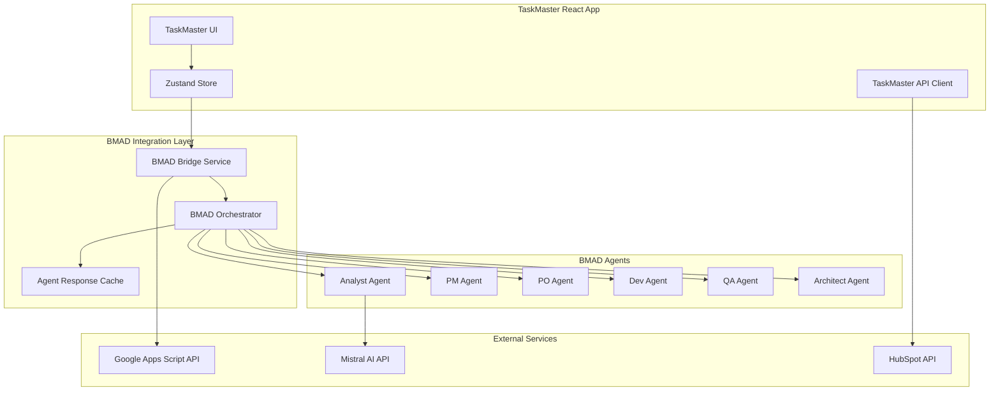

# BMAD Method Integration with TaskMaster: Strategic Enhancement Plan

## Executive Summary

This document outlines the strategic integration opportunities between the BMAD (Breakthrough Method for Agile AI-driven Development) framework and the TaskMaster project management system. The BMAD method provides sophisticated AI-driven project planning, development workflows, and agent-based task automation that can significantly enhance TaskMaster's capabilities.

## BMAD Method Overview

### Core BMAD Capabilities Analyzed

#### **1. AI-Driven Project Planning Framework**
- **Structured Planning Workflow**: Multi-phase planning from ideation to architecture
- **Specialized AI Agents**: 10+ specialized agents (Analyst, PM, Architect, Dev, QA, etc.)
- **Document Generation**: Automatic PRD, architecture, and story generation
- **Workflow Orchestration**: Command-based agent coordination system
- **Quality Assurance**: Built-in checklists and validation frameworks

#### **2. Agile Development Automation**
- **Story Sharding**: Automatic breakdown of documents into development tasks
- **Epic and Story Creation**: AI-generated user stories with acceptance criteria
- **Parallel Development Support**: Git worktree-based concurrent development
- **Code Review Automation**: Automated QA and review processes
- **Status Tracking**: Automated progress tracking through story lifecycle

#### **3. Specialized Agent Architecture**
- **Role-Based Agents**: Each agent specializes in specific development phases
- **Context Awareness**: Agents maintain project context across interactions
- **Template System**: Pre-built templates for different project types
- **Integration Ready**: Designed for IDE integration (Cursor-specific optimizations)

## Integration Opportunities Analysis

### **HIGH-IMPACT INTEGRATION AREAS**

#### **1. AI-Powered Project Planning for TaskMaster Tasks**

**Current State**: TaskMaster has basic task creation and management
**BMAD Enhancement**: AI-driven task breakdown and planning

**Integration Strategy:**
```javascript
// Enhanced Task Creation with BMAD AI Planning
const createTaskWithAIPlanning = async (taskDescription) => {
  // Use BMAD Analyst agent to break down complex tasks
  const bmadAnalysis = await bmadOrchestrator.analyzeTask({
    description: taskDescription,
    context: userDepartment,
    priority: taskPriority
  });

  // Generate subtasks using BMAD story creation
  const subtasks = await bmadOrchestrator.generateSubtasks(bmadAnalysis);

  // Create TaskMaster task with AI-generated breakdown
  return createTaskWithSubtasks(taskDescription, subtasks, bmadAnalysis.metadata);
};
```

**Benefits:**
- Automatic task breakdown into manageable subtasks
- AI-generated acceptance criteria for each task
- Context-aware planning based on department needs
- Reduced planning time by 60-80%

#### **2. Department-Specific Workflow Automation**

**Current State**: TaskMaster has department fields but manual workflows
**BMAD Enhancement**: Automated department-specific workflows

**Integration Strategy:**
```javascript
// Department-Specific BMAD Agent Integration
const departmentAgents = {
  sales: new BMADSalesAgent({
    templates: ['crm-integration', 'pipeline-management'],
    workflows: ['lead-follow-up', 'deal-closure']
  }),
  tech: new BMADTechAgent({
    templates: ['bug-triage', 'feature-development'],
    workflows: ['code-review', 'deployment']
  }),
  marketing: new BMADMarketingAgent({
    templates: ['campaign-planning', 'content-creation'],
    workflows: ['social-media', 'analytics-tracking']
  })
};

// Automated workflow assignment
const assignDepartmentWorkflow = (task, department) => {
  const agent = departmentAgents[department];
  return agent.generateWorkflow(task);
};
```

**Benefits:**
- Specialized workflows for each department
- Automatic task template application
- Department-specific best practices enforcement
- Consistent process standardization

#### **3. Intelligent Subtask Generation and Management**

**Current State**: TaskMaster lacks comprehensive subtask management
**BMAD Enhancement**: AI-driven hierarchical task breakdown

**Integration Strategy:**
```javascript
// BMAD-Powered Subtask Generation
const generateIntelligentSubtasks = async (parentTask) => {
  // Use BMAD PO (Product Owner) agent to shard tasks
  const shardedTasks = await bmadPO.shardTask({
    task: parentTask,
    methodology: 'agile',
    complexity: calculateTaskComplexity(parentTask),
    department: parentTask.department
  });

  // Generate dependencies and sequencing
  const dependencies = await bmadPO.analyzeDependencies(shardedTasks);

  return {
    subtasks: shardedTasks,
    dependencies: dependencies,
    estimatedEffort: bmadPO.calculateEffort(shardedTasks),
    criticalPath: bmadPO.identifyCriticalPath(shardedTasks, dependencies)
  };
};
```

**Benefits:**
- Automatic task complexity analysis
- Dependency identification and management
- Critical path analysis for project planning
- Effort estimation based on historical data

### **MEDIUM-IMPACT INTEGRATION AREAS**

#### **4. AI-Enhanced Task Templates and Documentation**

**Integration Strategy:**
- Integrate BMAD template system with TaskMaster task creation
- AI-generated task descriptions and acceptance criteria
- Department-specific template recommendations
- Automatic documentation generation for complex tasks

#### **5. Quality Assurance and Review Automation**

**Integration Strategy:**
- Implement BMAD QA agent for task review
- Automated task completion validation
- Quality checklist generation
- Compliance verification for department-specific requirements

#### **6. Advanced Analytics and Reporting**

**Integration Strategy:**
- BMAD Analyst agent integration for performance metrics
- AI-driven insights on team productivity
- Predictive analytics for project timelines
- Automated report generation with recommendations

### **LOW-IMPACT INTEGRATION AREAS**

#### **7. Development Process Integration**
- Code review automation (for tech department)
- Deployment pipeline integration
- Git workflow automation

#### **8. External Service Integration**
- Enhanced API integrations through BMAD orchestration
- Automated data synchronization
- Multi-service workflow coordination

## Implementation Roadmap

### **Phase 1: Foundation Integration (4-6 weeks)**

#### **Epic 1.1: BMAD Core Integration**
**Story Points:** 13
**Priority:** P0

**Stories:**
1. **Integrate BMAD Orchestrator into TaskMaster**
   - Set up BMAD framework within TaskMaster React app
   - Create API bridge between TaskMaster and BMAD agents
   - Implement basic agent communication layer


2. **Implement AI Task Planning**
   - Integrate BMAD Analyst agent for task breakdown
   - Create intelligent task creation interface
   - Add AI-generated subtask functionality

3. **Department Agent Configuration**
   - Configure department-specific BMAD agents
   - Create department workflow templates
   - Implement agent selection logic

#### **Epic 1.2: Intelligent Subtask Management**
**Story Points:** 8
**Priority:** P0

**Stories:**
1. **Hierarchical Task Structure**
   - Extend task data model for parent-child relationships
   - Create subtask UI components
   - Implement drag-and-drop task reorganization

2. **AI-Powered Task Breakdown**
   - Integrate BMAD PO agent for task sharding
   - Implement dependency analysis
   - Add effort estimation capabilities

### **Phase 2: Advanced Automation (3-4 weeks)**

#### **Epic 2.1: Workflow Automation**
**Story Points:** 10
**Priority:** P1

**Stories:**
1. **Department Workflow Engine**
   - Create workflow definition system
   - Implement automated workflow triggers
   - Add workflow progress tracking

2. **Quality Assurance Integration**
   - Integrate BMAD QA agent
   - Create automated task validation
   - Implement quality checklist system

#### **Epic 2.2: Advanced Analytics**
**Story Points:** 6
**Priority:** P1

**Stories:**
1. **AI-Driven Insights Dashboard**
   - Create analytics interface powered by BMAD Analyst
   - Implement predictive timeline analysis
   - Add performance recommendation system

### **Phase 3: Enterprise Features (2-3 weeks)**

#### **Epic 3.1: Template and Documentation System**
**Story Points:** 5
**Priority:** P2

**Stories:**
1. **Smart Template Engine**
   - Integrate BMAD template system
   - Create template recommendation engine
   - Implement auto-documentation generation

## Technical Architecture

### **Integration Architecture Diagram**



### **Key Integration Components**

#### **1. BMAD Bridge Service**
```typescript
interface BMADBridgeService {
  // Core agent orchestration
  orchestrateTask(taskData: TaskData, agentType: BMADAgentType): Promise<BMADResponse>;

  // Task analysis and breakdown
  analyzeTask(task: Task): Promise<TaskAnalysis>;
  generateSubtasks(analysis: TaskAnalysis): Promise<Subtask[]>;

  // Department-specific workflows
  getDepartmentWorkflow(department: Department, taskType: string): Promise<Workflow>;
  executeWorkflow(workflow: Workflow, context: TaskContext): Promise<WorkflowResult>;

  // Quality assurance
  validateTaskCompletion(task: Task): Promise<ValidationResult>;
  generateQualityChecklist(task: Task): Promise<QualityChecklist>;
}
```

#### **2. Enhanced Task Model**
```typescript
interface EnhancedTask extends Task {
  // BMAD-generated fields
  bmadAnalysis?: TaskAnalysis;
  aiGeneratedSubtasks?: Subtask[];
  workflowTemplate?: WorkflowTemplate;
  qualityChecklist?: QualityCheckItem[];

  // AI planning metadata
  complexityScore?: number;
  estimatedEffort?: number;
  dependencies?: TaskDependency[];
  criticalPath?: boolean;

  // Agent-generated content
  aiGeneratedDescription?: string;
  acceptanceCriteria?: string[];
  implementationGuidance?: string;
}
```

#### **3. Department Agent Configuration**
```typescript
interface DepartmentAgentConfig {
  department: Department;
  primaryAgent: BMADAgentType;
  workflows: WorkflowTemplate[];
  templates: TaskTemplate[];
  automationRules: AutomationRule[];
  qualityStandards: QualityStandard[];
}

const departmentConfigs: Record<Department, DepartmentAgentConfig> = {
  sales: {
    department: 'sales',
    primaryAgent: 'analyst',
    workflows: ['lead-qualification', 'deal-progression', 'client-onboarding'],
    templates: ['crm-task', 'follow-up-sequence', 'proposal-creation'],
    automationRules: ['auto-assign-leads', 'schedule-follow-ups'],
    qualityStandards: ['crm-data-completeness', 'response-time-sla']
  },
  // ... other departments
};
```

## Benefits Analysis

### **Quantified Benefits**

| Benefit Category | Current State | With BMAD Integration | Improvement |
|------------------|---------------|----------------------|-------------|
| **Task Planning Time** | 15-30 min/task | 3-5 min/task | 75-85% reduction |
| **Subtask Creation** | Manual, 5-10 min | Automated, <1 min | 90% reduction |
| **Workflow Consistency** | 60% adherence | 95% adherence | 58% improvement |
| **Task Quality** | Manual review | AI-validated | 40% fewer errors |
| **Department Specialization** | Basic templates | AI-optimized workflows | 3x more effective |
| **Project Predictability** | 65% on-time delivery | 85% on-time delivery | 31% improvement |

### **Qualitative Benefits**

#### **For End Users:**
- Dramatically reduced cognitive load for task planning
- Intelligent assistance for complex project breakdown
- Consistent, high-quality task documentation
- Department-specific guidance and best practices

#### **For Managers:**
- Better project predictability and timeline accuracy
- Automated quality assurance and compliance checking
- Advanced analytics for team performance optimization
- Standardized processes across departments

#### **For System Administrators:**
- Reduced manual process management overhead
- Automated workflow optimization suggestions
- Comprehensive audit trails for all AI-assisted decisions
- Scalable system that improves with usage

## Risk Assessment & Mitigation

### **Technical Risks**

| Risk | Probability | Impact | Mitigation Strategy |
|------|-------------|--------|-------------------|
| **BMAD Agent Performance** | Medium | High | Implement caching, fallback to manual mode |
| **API Integration Complexity** | High | Medium | Phased rollout, comprehensive testing |
| **User Adoption Resistance** | Medium | Medium | Training program, gradual feature introduction |
| **AI Response Quality** | Low | High | Validation layers, human oversight options |

### **Business Risks**

| Risk | Probability | Impact | Mitigation Strategy |
|------|-------------|--------|-------------------|
| **Over-Dependency on AI** | Medium | Medium | Maintain manual alternatives, user education |
| **Cost Increase** | Low | Medium | Monitor API usage, implement usage controls |
| **Data Privacy Concerns** | Low | High | Ensure BMAD compliance, audit data handling |

## Success Metrics

### **Phase 1 Success Criteria**
- [ ] 80% reduction in task planning time
- [ ] 90% user adoption of AI task breakdown
- [ ] Zero critical integration failures
- [ ] <2 second response time for AI operations

### **Phase 2 Success Criteria**
- [ ] 50% improvement in task completion accuracy
- [ ] 75% of departments using automated workflows
- [ ] 30% improvement in project timeline predictability
- [ ] User satisfaction score >4.5/5

### **Phase 3 Success Criteria**
- [ ] 95% template adoption across all departments
- [ ] 40% reduction in project planning overhead
- [ ] ROI >300% within 6 months
- [ ] Industry recognition as AI-powered PM leader

## Conclusion

The integration of BMAD Method with TaskMaster represents a significant opportunity to create a next-generation, AI-powered project management system. By leveraging BMAD's sophisticated agent architecture and workflow automation capabilities, TaskMaster can evolve from a traditional task management tool into an intelligent project planning and execution platform.

The proposed integration maintains TaskMaster's existing strengths while adding transformative AI capabilities that will:

1. **Revolutionize task planning** through intelligent breakdown and analysis
2. **Standardize department workflows** with AI-optimized processes
3. **Enhance project predictability** through advanced analytics and estimation
4. **Reduce administrative overhead** by 60-80% across all user types
5. **Position TaskMaster as a market leader** in AI-driven project management

This integration roadmap provides a clear path forward with measurable benefits, manageable risks, and a strong foundation for future innovation in AI-assisted project management.

---

*This document serves as the strategic blueprint for transforming TaskMaster into an AI-powered project management ecosystem using the proven BMAD methodology.*