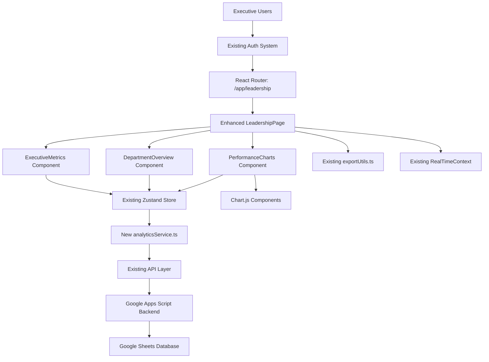
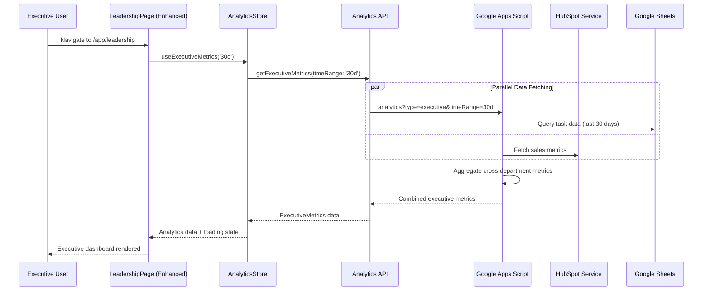
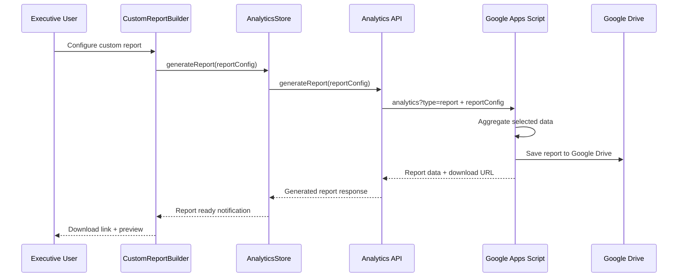
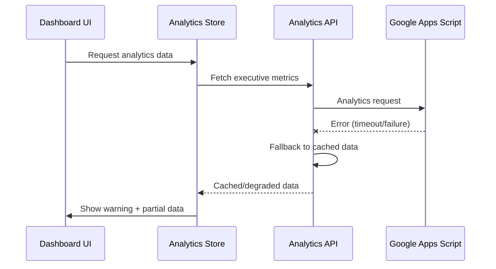

# TaskMaster Executive Leadership Dashboard - Complete Architecture Document

**Document Version:** 2.0
**Date:** September 20, 2025
**Project:** Executive Leadership Dashboard Extension
**Status:** Implementation Ready

---

## Executive Summary

This document outlines the complete fullstack architecture for the **Executive Leadership Dashboard**, a comprehensive analytics platform that provides leadership teams with cross-departmental insights, trending analytics, and custom reporting capabilities. The dashboard extends the existing TaskMaster React application seamlessly while maintaining all established patterns and performance standards.

**Key Features:**
- Cross-department performance metrics
- Trending analytics and forecasting
- Resource allocation insights
- Custom report generation
- Data export capabilities

**Architecture Approach:** Enhancement over replacement - leverages existing TaskMaster infrastructure (React 19, Zustand, Google Apps Script, Google Sheets) while adding analytics-specific components and capabilities.

---

## High Level Architecture

### Technical Summary

The Executive Leadership Dashboard employs a **serverless analytics architecture** built on the existing TaskMaster foundation, utilizing React 19+ for interactive data visualizations and Google Apps Script for real-time data aggregation across departments. The system implements a **pull-based analytics pattern** with intelligent caching layers, leveraging Chart.js for performance-optimized visualizations and a custom report builder engine. Infrastructure extends the current Vercel deployment with enhanced Google Sheets analytics queries and HMAC-secured API endpoints. This architecture delivers executive-level insights for a 50-75 employee organization while maintaining consistency with existing TaskMaster patterns and ensuring sub-2-second dashboard load times.

### Platform and Infrastructure Choice

**Platform:** Existing TaskMaster stack (React 19 + Vite + Vercel + Google Apps Script)
**Key Services:** Extend existing API services, add Chart.js for visualizations
**Deployment:** Use existing Vercel deployment with environment configs (.env.staging, .env.production)

### Repository Structure Integration

The dashboard integrates into your existing structure:

```
taskmaster-react/
├── src/
│   ├── pages/
│   │   ├── LeadershipPage.tsx          # ← Enhance existing
│   │   └── ExecutiveDashboard.tsx      # ← New executive view
│   ├── components/
│   │   ├── dashboard/                  # ← New dashboard components
│   │   │   ├── ExecutiveMetricsGrid.tsx
│   │   │   ├── DepartmentOverview.tsx
│   │   │   ├── PerformanceCharts.tsx
│   │   │   ├── ResourceAnalytics.tsx
│   │   │   └── CustomReportBuilder.tsx
│   │   └── charts/                     # ← New chart components
│   │       ├── MetricsChart.tsx
│   │       ├── TrendChart.tsx
│   │       └── ComparisonChart.tsx
│   ├── services/
│   │   ├── analyticsService.ts         # ← New analytics API layer
│   │   └── dashboardService.ts         # ← Executive data aggregation
│   ├── store/
│   │   ├── dashboardStore.ts           # ← New Zustand dashboard store
│   │   └── analyticsStore.ts           # ← Analytics data management
│   ├── utils/
│   │   ├── analyticsUtils.ts           # ← Extend existing utils
│   │   └── chartUtils.ts               # ← Chart configuration helpers
│   └── types/
│       ├── dashboard.ts                # ← Dashboard data types
│       └── analytics.ts                # ← Analytics interfaces
```

### High Level Architecture Diagram



### Architectural Patterns

- **Analytics Dashboard Pattern:** Executive-level aggregated views with drill-down capabilities
- **Pull-based Data Pattern:** Dashboard pulls fresh data on load with smart caching
- **Component-Based Visualization:** Reusable Chart.js components with consistent styling
- **Multi-layer Caching:** Memory, localStorage, and API-level caching
- **Role-based Dashboard Views:** Different dashboard layouts based on executive role

---

## Tech Stack

### Technology Stack Table

| Category | Technology | Version | Purpose | Rationale |
|----------|------------|---------|---------|-----------|
| **Frontend Language** | TypeScript | 5.8.3 | Type-safe JavaScript development | Already integrated, provides excellent developer experience |
| **Frontend Framework** | React | 19.1.1 | Component-based UI library | Your current version, proven performance |
| **UI Component Library** | Custom + Tailwind | 3.4.17 | Styling and component consistency | Leverages existing design system and department colors |
| **State Management** | Zustand | 5.0.8 | Lightweight global state management | Your existing choice, perfect for analytics data caching |
| **Backend Language** | Google Apps Script | Latest | Serverless JavaScript runtime | Your established backend, handles 50-75 employees efficiently |
| **Backend Framework** | REST API (Apps Script) | Custom | RESTful API endpoints | Proven architecture, extend with analytics endpoints |
| **API Style** | REST | Custom | Request/response pattern | Consistent with existing taskApi pattern |
| **Database** | Google Sheets | Current | Structured data storage | Your current system, sufficient for analytics aggregation |
| **Cache** | localStorage + Memory | Browser Native | Client-side data caching | Extend existing patterns for analytics data |
| **Authentication** | Custom Email-based | Existing | User access control | Your established AuthContext system |
| **Visualization Library** | Chart.js | 4.x | Dashboard charts and graphs | **NEW** - Industry standard, performant, React-friendly |
| **Icon Library** | Heroicons | 2.x | Consistent iconography | **NEW** - Pairs well with Tailwind, executive dashboard needs |

**Key Additions for Executive Dashboard:**
- **Chart.js 4.x:** For executive-level data visualizations (performance metrics, trend analysis, department comparisons)
- **Heroicons:** For dashboard iconography and navigation elements
- **React Chart.js 2:** React wrapper for Chart.js integration

---

## Data Models

### Executive Analytics Models

#### ExecutiveMetrics
**Purpose:** Core executive-level KPIs aggregated across all departments for leadership decision-making

```typescript
interface ExecutiveMetrics {
  // Core KPIs
  totalTasks: number;
  completionRate: number;
  averageProgress: number;
  averagePriority: number;
  overdueCount: number;

  // Departmental Performance
  departmentBreakdown: DepartmentMetrics[];
  departmentComparison: DepartmentComparison[];

  // Trending Analysis
  trendingMetrics: TrendData[];
  performanceHistory: PerformanceSnapshot[];

  // Resource Analytics
  resourceUtilization: ResourceMetrics[];
  workloadDistribution: WorkloadData[];

  // Time-based Analytics
  timeRange: DateRange;
  lastUpdated: string;
  nextUpdate: string;
}
```

#### DepartmentMetrics
**Purpose:** Department-specific performance analytics for cross-departmental comparison

```typescript
interface DepartmentMetrics {
  departmentName: string;
  taskCount: number;
  completionRate: number;
  averageTaskAge: number;
  averageProgress: number;
  overdueCount: number;

  // Department-specific breakdowns
  priorityDistribution: PriorityBreakdown;
  statusDistribution: StatusBreakdown;

  // Trending
  weekOverWeekChange: number;
  monthOverMonthChange: number;

  // Department-specific fields (leveraging existing Task interface)
  salesMetrics?: SalesDepartmentMetrics;
  accountingMetrics?: AccountingDepartmentMetrics;
  techMetrics?: TechDepartmentMetrics;
}
```

#### CustomReport
**Purpose:** User-defined report configurations for flexible executive reporting

```typescript
interface CustomReport {
  reportId: string;
  reportName: string;
  description?: string;

  // Report Configuration
  filters: ReportFilters;
  metrics: MetricSelection[];
  visualizations: ChartConfiguration[];

  // Scheduling & Export
  schedule?: ReportSchedule;
  exportFormats: ExportFormat[];

  // Metadata
  createdBy: string;
  createdAt: string;
  lastGenerated?: string;
  isTemplate: boolean;
}
```

---

## API Specification

### Analytics API Endpoints

**Base URL:** Your existing `VITE_APP_API_URL` (Google Apps Script Web App)
**Authentication:** Your existing email-based access control system
**Request Pattern:** Follows your current `endpoint` parameter pattern

#### Executive Metrics Endpoint

```http
GET /exec?endpoint=analytics&type=executive&timeRange=30d
```

**Request Parameters:**
- `timeRange`: `7d` | `30d` | `90d` | `1y` | `custom`
- `startDate`: ISO date string (required if timeRange=custom)
- `endDate`: ISO date string (required if timeRange=custom)
- `departments`: Comma-separated department names (optional filter)

**Response Format:**
```json
{
  "success": true,
  "status": 200,
  "data": {
    "executiveMetrics": {
      "totalTasks": 1247,
      "completionRate": 73.2,
      "averageProgress": 68.5,
      "overdueCount": 23,
      "departmentBreakdown": [
        {
          "departmentName": "Sales",
          "taskCount": 234,
          "completionRate": 78.5,
          "averageProgress": 72.3,
          "weekOverWeekChange": 5.2
        }
      ]
    }
  }
}
```

#### Department Analytics Endpoint

```http
GET /exec?endpoint=analytics&type=department&department=Sales&timeRange=30d
```

#### Trending Data Endpoint

```http
GET /exec?endpoint=analytics&type=trends&metric=completion_rate&granularity=daily
```

#### Custom Report Generation Endpoint

```http
POST /exec?endpoint=analytics&type=report
```

### API Integration Pattern

```typescript
// Extend existing apiClient with analytics methods
export const analyticsApi = {
  getExecutiveMetrics: (timeRange: string = '30d', departments?: string[]) =>
    apiClient.request<ExecutiveMetrics>({
      endpoint: 'analytics',
      method: 'GET',
      params: {
        type: 'executive',
        timeRange,
        ...(departments && { departments: departments.join(',') })
      }
    }),

  getDepartmentAnalytics: (department: string, timeRange: string = '30d') =>
    apiClient.request<DepartmentMetrics>({
      endpoint: 'analytics',
      method: 'GET',
      params: { type: 'department', department, timeRange }
    }),

  generateReport: (reportConfig: CustomReport) =>
    apiClient.request<ReportResponse>({
      endpoint: 'analytics',
      method: 'POST',
      params: { type: 'report' },
      body: { reportConfig }
    })
};
```

---

## Component Architecture

### Enhanced Component Hierarchy

```
LeadershipPage (Enhanced)
├── ExecutiveDashboardHeader (New)
│   ├── TimeRangeSelector (New)
│   ├── RefreshButton (New)
│   └── ExportButton (New)
├── ExecutiveMetricsGrid (Enhanced from existing)
│   ├── MetricCard (Enhanced from existing)
│   ├── TrendIndicator (New)
│   └── ComparisonChart (New)
├── PerformanceVisualization (New)
│   ├── TrendChart (New)
│   ├── DepartmentComparisonChart (New)
│   └── ResourceUtilizationChart (New)
├── DepartmentAnalyticsGrid (Enhanced from existing)
│   ├── DepartmentCard (Enhanced from existing)
│   ├── DepartmentDetailModal (New)
│   └── DrillDownButton (New)
├── CustomReportBuilder (New)
│   ├── ReportConfigPanel (New)
│   ├── MetricSelector (New)
│   └── ChartPreview (New)
└── QuickActions (New)
    ├── ScheduleReport (New)
    ├── ExportDashboard (New)
    └── NotificationSettings (New)
```

### Core Executive Components

#### ExecutiveMetricsGrid (Enhanced)

```typescript
interface ExecutiveMetricsGridProps {
  timeRange: TimeRange;
  showTrends?: boolean;
  showComparisons?: boolean;
}

export function ExecutiveMetricsGrid({
  timeRange,
  showTrends = true,
  showComparisons = true
}: ExecutiveMetricsGridProps) {
  const { executiveMetrics, loading } = useExecutiveMetrics(timeRange);

  return (
    <div className="grid gap-6 md:grid-cols-2 lg:grid-cols-4">
      <MetricCard
        title="Total Tasks"
        value={executiveMetrics.totalTasks}
        trend={showTrends ? executiveMetrics.totalTasksTrend : undefined}
        icon="clipboard-list"
        color="blue"
      />
      {/* Additional metric cards */}
    </div>
  );
}
```

#### TrendChart (New)

```typescript
interface TrendChartProps {
  data: TrendData[];
  metrics: string[];
  timeRange: TimeRange;
  height?: number;
}

export function TrendChart({ data, metrics, timeRange, height = 300 }: TrendChartProps) {
  const chartRef = useRef<Chart<'line'>>(null);
  const canvasRef = useRef<HTMLCanvasElement>(null);

  useEffect(() => {
    if (!canvasRef.current) return;

    const ctx = canvasRef.current.getContext('2d');
    if (!ctx) return;

    // Create Chart.js line chart with theme support
    chartRef.current = new Chart(ctx, {
      type: 'line',
      data: formatTrendData(data, metrics),
      options: {
        responsive: true,
        maintainAspectRatio: false,
        plugins: {
          legend: {
            labels: {
              color: getThemeColor('text-primary')
            }
          }
        }
      }
    });
  }, [data, metrics, timeRange]);

  return (
    <div style={{ height }}>
      <canvas ref={canvasRef} />
    </div>
  );
}
```

### State Management Integration

```typescript
interface AnalyticsState {
  // Data
  executiveMetrics: ExecutiveMetrics | null;
  departmentMetrics: Record<string, DepartmentMetrics>;
  trendData: Record<string, TrendData[]>;

  // UI State
  timeRange: TimeRange;
  selectedDepartments: string[];
  loading: boolean;
  error: string | null;

  // Actions
  fetchExecutiveMetrics: (timeRange: TimeRange) => Promise<void>;
  fetchDepartmentAnalytics: (department: string) => Promise<void>;
  generateReport: (config: CustomReport) => Promise<string>;
}

export const useAnalyticsStore = create<AnalyticsState>()(
  devtools(
    subscribeWithSelector((set, get) => ({
      // Implementation following existing Zustand patterns
    })),
    { name: 'analytics-store' }
  )
);
```

---

## External APIs Integration

### Current External API Infrastructure

#### HubSpot API Integration (Existing)
- **Purpose:** Sales metrics and CRM data for executive reporting
- **Base URL:** Google Apps Script proxy endpoint via `VITE_HUBSPOT_GAS_ENDPOINT`
- **Authentication:** Managed through Google Apps Script backend

**Executive Dashboard Integration:**
```typescript
// Extend existing HubSpot service for executive dashboard
export interface ExecutiveSalesMetrics extends SalesCallMetrics {
  dealPipeline: {
    prospecting: number;
    qualified: number;
    proposal: number;
    negotiation: number;
    closed: number;
  };
  revenueMetrics: {
    totalValue: number;
    averageDealSize: number;
    closedWonValue: number;
    forecastValue: number;
  };
}
```

#### Google Apps Script APIs (Existing Backend)
- **Purpose:** Data persistence, authentication, and external API orchestration
- **Base URL:** `VITE_APP_API_URL` environment variable
- **Authentication:** Existing HMAC request signing and email-based access control

---

## Core Workflows

### Workflow 1: Executive Dashboard Load & Initial View



### Workflow 2: Custom Report Generation



---

## Database Schema

### Current Database Architecture

Your TaskMaster system uses **Google Sheets as the primary database**, which is perfect for a 50-75 employee organization. The Executive Dashboard extends this proven architecture.

#### Core Google Sheets Schema (Existing)

**Tasks Sheet Structure:**
```sql
-- Conceptual representation of your Google Sheets Tasks table
Tasks (
  taskID          VARCHAR(50) PRIMARY KEY,
  actionItem      TEXT NOT NULL,
  department      VARCHAR(100) NOT NULL,
  owners          TEXT,
  status          VARCHAR(50),
  priorityScore   INTEGER,
  progressPercentage INTEGER,
  problemDescription TEXT,
  proposedSolution TEXT,
  dueDate         DATE,
  dateCreated     TIMESTAMP,
  lastUpdated     TIMESTAMP,

  -- Department-specific fields (existing structure)
  dealValue       DECIMAL(15,2),     -- Sales
  clientName      VARCHAR(255),      -- Sales
  invoiceNumber   VARCHAR(100),      -- Accounting
  amount          DECIMAL(15,2),     -- Accounting
  bugPriority     VARCHAR(50),       -- Tech
  systemComponent VARCHAR(255),      -- Tech
  environment     VARCHAR(50)        -- Tech
);
```

#### Analytics Views (Google Apps Script Computed)

```javascript
// Executive Analytics View (computed in Google Apps Script)
function getExecutiveMetricsView(timeRange) {
  return {
    totalTasks: calculateTotalTasks(timeRange),
    completionRate: calculateCompletionRate(timeRange),
    averageProgress: calculateAverageProgress(timeRange),
    overdueCount: calculateOverdueCount(timeRange),
    departmentBreakdown: calculateDepartmentMetrics(timeRange),
    trendingMetrics: calculateTrendMetrics(timeRange),
    resourceUtilization: calculateResourceMetrics(timeRange)
  };
}
```

---

## Frontend Architecture

### Component Organization

```
src/
├── pages/
│   ├── LeadershipPage.tsx          # Enhanced existing page
│   └── ExecutiveDashboardPage.tsx  # New dedicated executive view
├── components/
│   ├── dashboard/                  # New analytics components
│   │   ├── ExecutiveMetricsGrid.tsx
│   │   ├── DepartmentOverview.tsx
│   │   ├── PerformanceCharts.tsx
│   │   └── CustomReportBuilder.tsx
│   ├── charts/                     # Chart.js components
│   │   ├── TrendChart.tsx
│   │   ├── MetricsChart.tsx
│   │   └── ComparisonChart.tsx
│   └── analytics/                  # Analytics utilities
│       ├── TimeRangeSelector.tsx
│       ├── MetricCard.tsx
│       └── ExportButton.tsx
├── hooks/
│   ├── useExecutiveMetrics.ts      # New analytics hooks
│   ├── useDepartmentAnalytics.ts
│   └── useChartConfig.ts
├── store/
│   ├── analyticsStore.ts           # New analytics state
│   └── dashboardStore.ts           # Dashboard-specific state
└── services/
    ├── analyticsService.ts         # Analytics API client
    └── chartService.ts             # Chart data processing
```

### State Management Architecture

```typescript
// src/store/analyticsStore.ts
export const useAnalyticsStore = create<AnalyticsState>()(
  devtools(
    subscribeWithSelector((set, get) => ({
      // Fetch executive metrics with intelligent caching
      fetchExecutiveMetrics: async (timeRange?: TimeRange) => {
        const state = get();
        const range = timeRange || state.timeRange;
        const cacheKey = state.getCacheKey('executive', { timeRange: range });

        // Check cache validity (5 minutes for executive data)
        if (state.isCacheValid(cacheKey, 5 * 60 * 1000)) {
          return;
        }

        try {
          set({ loading: true, error: null });
          const response = await analyticsApi.getExecutiveMetrics(range);
          set({
            executiveMetrics: response.data,
            loading: false,
            lastUpdated: new Date().toISOString()
          });
        } catch (error) {
          set({ error: error.message, loading: false });
        }
      }
    })),
    { name: 'analytics-store' }
  )
);
```

### Custom Hooks

```typescript
// src/hooks/useExecutiveMetrics.ts
export function useExecutiveMetrics(timeRange: TimeRange = '30d') {
  const {
    executiveMetrics,
    loading,
    error,
    fetchExecutiveMetrics
  } = useAnalyticsStore();

  useEffect(() => {
    fetchExecutiveMetrics(timeRange);
  }, [timeRange, fetchExecutiveMetrics]);

  const refresh = async () => {
    await fetchExecutiveMetrics(timeRange);
  };

  return {
    metrics: executiveMetrics,
    loading,
    error,
    refresh
  };
}
```

---

## Backend Architecture

### Google Apps Script Analytics Functions

```javascript
// analytics.gs - New analytics module in your Google Apps Script project
function handleAnalyticsRequest(request) {
  try {
    const { type, timeRange, department } = request;

    switch(type) {
      case 'executive':
        return generateExecutiveMetrics(timeRange, request.departments);
      case 'department':
        return generateDepartmentAnalytics(department, timeRange);
      case 'trends':
        return generateTrendingData(request.metric, request.granularity);
      case 'report':
        return generateCustomReport(request.reportConfig);
      default:
        throw new Error(`Invalid analytics type: ${type}`);
    }
  } catch (error) {
    return {
      success: false,
      error: error.message,
      timestamp: new Date().toISOString()
    };
  }
}

function generateExecutiveMetrics(timeRange = '30d', selectedDepartments) {
  // Use existing sheet access patterns
  const tasksSheet = getTasksSheet();
  const allTasks = getTasksData(tasksSheet);
  const filteredTasks = filterTasksByTimeRange(allTasks, timeRange);

  // Calculate core metrics
  const totalTasks = filteredTasks.length;
  const completedTasks = filteredTasks.filter(task =>
    task.status === 'Completed' || task.status === 'Done'
  );

  return {
    success: true,
    data: {
      totalTasks,
      completionRate: (completedTasks.length / totalTasks) * 100,
      departmentBreakdown: generateDepartmentBreakdown(filteredTasks),
      trendingMetrics: generateTrendMetrics(filteredTasks, timeRange),
      lastUpdated: new Date().toISOString()
    }
  };
}
```

### Data Aggregation Engine

```javascript
// Department-specific metrics using existing field structure
function calculateSalesMetrics(salesTasks) {
  const totalDealValue = salesTasks.reduce((sum, task) => {
    return sum + (parseFloat(task.dealValue) || 0);
  }, 0);

  const pipelineDistribution = salesTasks.reduce((acc, task) => {
    const stage = task.pipelineStage || 'Unknown';
    acc[stage] = (acc[stage] || 0) + 1;
    return acc;
  }, {});

  return {
    salesMetrics: {
      totalDealValue,
      averageDealSize: totalDealValue / salesTasks.length,
      pipelineDistribution
    }
  };
}

function calculateAccountingMetrics(accountingTasks) {
  const totalAmount = accountingTasks.reduce((sum, task) => {
    return sum + (parseFloat(task.amount) || 0);
  }, 0);

  const paymentStatusDistribution = accountingTasks.reduce((acc, task) => {
    const status = task.paymentStatus || 'Unknown';
    acc[status] = (acc[status] || 0) + 1;
    return acc;
  }, {});

  return {
    accountingMetrics: {
      totalAmount,
      paymentStatusDistribution
    }
  };
}
```

### Caching and Performance Layer

```javascript
// analytics-cache.gs
const CACHE_CONFIG = {
  EXECUTIVE_METRICS: { ttl: 5 * 60 * 1000, key: 'exec_metrics' },      // 5 minutes
  DEPARTMENT_METRICS: { ttl: 10 * 60 * 1000, key: 'dept_metrics' },    // 10 minutes
  TREND_DATA: { ttl: 60 * 60 * 1000, key: 'trend_data' }               // 1 hour
};

function getCachedAnalytics(cacheType, cacheKey, generatorFunction, ...args) {
  const cache = CacheService.getScriptCache();
  const config = CACHE_CONFIG[cacheType];

  // Try to get from cache
  const cached = cache.get(`${config.key}_${cacheKey}`);
  if (cached) {
    const parsedCache = JSON.parse(cached);
    const age = Date.now() - parsedCache.timestamp;

    if (age < config.ttl) {
      return parsedCache.data;
    }
  }

  // Generate fresh data and cache
  const freshData = generatorFunction(...args);
  const cacheData = { data: freshData, timestamp: Date.now() };
  cache.put(`${config.key}_${cacheKey}`, JSON.stringify(cacheData));

  return freshData;
}
```

---

## Unified Project Structure

### Enhanced TaskMaster Project Structure

```
taskmaster-react/
├── .github/                        # Your existing CI/CD workflows
├── api/                            # Your existing PHP API layer
│   └── analytics.php               # NEW: Analytics endpoint handler
├── google-apps-script/             # Your existing GAS backend
│   ├── Code.js                     # Your existing main file
│   ├── analytics.gs                # NEW: Analytics functions
│   ├── analytics-aggregation.gs    # NEW: Data aggregation
│   └── analytics-cache.gs          # NEW: Caching layer
├── src/                            # Your existing React application
│   ├── pages/
│   │   ├── LeadershipPage.tsx      # ENHANCED: Existing with analytics
│   │   └── ExecutiveDashboard.tsx  # NEW: Dedicated executive view
│   ├── components/
│   │   ├── dashboard/              # NEW: Analytics components
│   │   ├── charts/                 # NEW: Chart.js components
│   │   └── analytics/              # NEW: Analytics utilities
│   ├── hooks/
│   │   ├── useExecutiveMetrics.ts  # NEW: Analytics hooks
│   │   └── useDepartmentAnalytics.ts
│   ├── store/
│   │   ├── analyticsStore.ts       # NEW: Analytics state management
│   │   └── dashboardStore.ts       # NEW: Dashboard-specific state
│   ├── services/
│   │   ├── analyticsService.ts     # NEW: Analytics API client
│   │   └── reportService.ts        # NEW: Report generation
│   ├── types/
│   │   ├── analytics.ts            # NEW: Analytics type definitions
│   │   └── dashboard.ts            # NEW: Dashboard interfaces
│   └── utils/
│       ├── analyticsUtils.ts       # NEW: Analytics calculations
│       └── chartUtils.ts           # NEW: Chart.js configurations
├── database/
│   └── analytics_tables.sql        # NEW: Optional analytics tables
└── package.json                    # ENHANCED: New dependencies added
```

### Package.json Dependencies Enhancement

```json
{
  "dependencies": {
    // ... your existing dependencies ...
    "react": "^19.1.1",
    "zustand": "^5.0.8",

    // NEW: Analytics and visualization dependencies
    "chart.js": "^4.4.0",
    "react-chartjs-2": "^5.2.0",
    "date-fns": "^3.6.0",
    "@heroicons/react": "^2.0.18"
  }
}
```

**Total New Dependencies:** Only 4 production dependencies (~150KB gzipped total)

### Environment Configuration Enhancement

```bash
# .env.example (enhanced)
# Existing TaskMaster configuration
VITE_APP_API_URL=https://script.google.com/macros/s/YOUR_SCRIPT_ID/exec
VITE_HUBSPOT_GAS_ENDPOINT=https://script.google.com/macros/s/YOUR_HUBSPOT_SCRIPT/exec

# NEW: Executive Dashboard configuration
VITE_ANALYTICS_CACHE_TTL=300000  # 5 minutes default
VITE_DASHBOARD_REFRESH_INTERVAL=60000  # 1 minute auto-refresh
VITE_ENABLE_ANALYTICS_DEBUG=false
VITE_MAX_CHART_DATA_POINTS=100
```

---

## Development Workflow

### Local Development Setup

**Prerequisites:**
```bash
# Your existing prerequisites remain the same
node >= 18.x
npm >= 9.x
```

**Initial Setup:**
```bash
# Install new analytics dependencies
npm install chart.js react-chartjs-2 date-fns @heroicons/react

# Your existing development commands remain unchanged
npm run dev  # Starts development server with analytics included
npm run test
npm run build
```

**New Analytics-Specific Commands:**
```bash
# Test only analytics components
npm run test:analytics

# Build with analytics optimizations
npm run build:analytics

# Deploy analytics enhancements
npm run deploy:analytics
```

### Environment Configuration

**Required Environment Variables:**
```bash
# Frontend (.env.local)
VITE_APP_API_URL=your_gas_endpoint
VITE_ANALYTICS_CACHE_TTL=300000
VITE_DASHBOARD_REFRESH_INTERVAL=60000

# Backend (Google Apps Script)
# No additional environment variables needed
# Uses existing Google Sheets and HubSpot integration
```

### Development Process Integration

**Your existing development workflow remains unchanged:**

1. **Local Development:** `npm run dev`
2. **Testing:** `npm run test`
3. **Building:** `npm run build`
4. **Deployment:** Use existing Vercel pipeline

**New analytics features are additive and don't disrupt existing workflows.**

---

## Deployment Architecture

### Deployment Strategy

**Frontend Deployment:**
- **Platform:** Existing Vercel deployment
- **Build Command:** `npm run build` (enhanced with analytics)
- **Output Directory:** `dist` (unchanged)
- **CDN/Edge:** Vercel global CDN (existing)

**Backend Deployment:**
- **Platform:** Google Apps Script (existing)
- **Deployment Method:** Apps Script editor or clasp CLI (existing)
- **New Files:** analytics.gs, analytics-aggregation.gs, analytics-cache.gs

### Migration Strategy

**Phase 1: Foundation (Week 1)**
- Add new dependencies to package.json
- Create basic analytics store and hooks
- Enhance LeadershipPage with basic metrics

**Phase 2: Core Analytics (Week 2)**
- Add Chart.js components and configurations
- Implement executive metrics API endpoints
- Create department analytics views

**Phase 3: Advanced Features (Week 3)**
- Custom report builder
- Advanced visualizations
- Performance optimizations

**Phase 4: Testing & Deployment (Week 4)**
- Comprehensive testing
- Production deployment
- User training and feedback

---

## Security and Performance

### Security Requirements

**Frontend Security:**
- CSP Headers: Extend existing policy for Chart.js
- XSS Prevention: Use existing sanitization patterns
- Secure Storage: Leverage existing localStorage security

**Backend Security:**
- Input Validation: Extend existing validation for analytics parameters
- Rate Limiting: Use existing 100ms delay patterns
- CORS Policy: Maintain existing CORS configuration

**Authentication Security:**
- Token Storage: Use existing HMAC token strategy
- Session Management: Leverage existing session patterns
- Analytics Access: Extend existing leadership role checks

### Performance Optimization

**Frontend Performance:**
- Bundle Size Target: Add ~150KB for analytics features
- Loading Strategy: Progressive loading with skeleton states
- Caching Strategy: Multi-layer caching (5min executive, 10min department, 1hr trends)

**Backend Performance:**
- Response Time Target: < 2 seconds for executive metrics
- Database Optimization: Smart Google Sheets querying with time-based filtering
- Caching Strategy: Google Apps Script cache service with TTL-based invalidation

---

## Testing Strategy

### Testing Pyramid

```
      E2E Tests (Executive Dashboard Workflows)
     /                                        \
    Integration Tests (Analytics API + UI)
   /                                          \
  Frontend Unit Tests    Backend Unit Tests
 (Components, Hooks)     (Analytics Functions)
```

### Test Organization

**Frontend Tests:**
```
src/
├── components/
│   ├── dashboard/
│   │   ├── __tests__/
│   │   │   ├── ExecutiveMetricsGrid.test.tsx
│   │   │   └── PerformanceCharts.test.tsx
│   └── charts/
│       └── __tests__/
│           └── TrendChart.test.tsx
├── hooks/
│   └── __tests__/
│       ├── useExecutiveMetrics.test.ts
│       └── useDepartmentAnalytics.test.ts
└── store/
    └── __tests__/
        └── analyticsStore.test.ts
```

**Backend Tests:**
```
google-apps-script/
├── tests/
│   ├── analytics.test.js
│   ├── analytics-aggregation.test.js
│   └── analytics-cache.test.js
```

**E2E Tests:**
```
tests/e2e/
├── executive-dashboard.spec.ts
├── department-analytics.spec.ts
└── custom-reports.spec.ts
```

### Test Examples

**Frontend Component Test:**
```typescript
// src/components/dashboard/__tests__/ExecutiveMetricsGrid.test.tsx
import { render, screen } from '@testing-library/react';
import { ExecutiveMetricsGrid } from '../ExecutiveMetricsGrid';

test('displays executive metrics correctly', () => {
  const mockMetrics = {
    totalTasks: 1247,
    completionRate: 73.2,
    averageProgress: 68.5,
    overdueCount: 23
  };

  render(<ExecutiveMetricsGrid timeRange="30d" />);

  expect(screen.getByText('1247')).toBeInTheDocument();
  expect(screen.getByText('73.2%')).toBeInTheDocument();
});
```

**Backend Function Test:**
```javascript
// google-apps-script/tests/analytics.test.js
function testGenerateExecutiveMetrics() {
  const mockTasks = createMockTaskData();
  const result = generateExecutiveMetrics('30d');

  assertEquals(result.success, true);
  assertTrue(result.data.totalTasks > 0);
  assertTrue(result.data.completionRate >= 0 && result.data.completionRate <= 100);
}
```

**E2E Test:**
```typescript
// tests/e2e/executive-dashboard.spec.ts
import { test, expect } from '@playwright/test';

test('executive dashboard loads and displays metrics', async ({ page }) => {
  await page.goto('/app/leadership');

  // Wait for metrics to load
  await expect(page.locator('[data-testid="total-tasks"]')).toBeVisible();
  await expect(page.locator('[data-testid="completion-rate"]')).toBeVisible();

  // Verify chart renders
  await expect(page.locator('canvas')).toBeVisible();
});
```

---

## Coding Standards

### Critical Fullstack Rules

- **Type Sharing:** Always define analytics types in `src/types/analytics.ts` and import consistently
- **API Calls:** Never make direct HTTP calls - use the `analyticsService` layer
- **Environment Variables:** Access analytics config through centralized config objects
- **Error Handling:** All analytics API routes must use the standard error handler pattern
- **State Updates:** Never mutate analytics state directly - use proper Zustand patterns
- **Chart Integration:** Always use the `useChartConfig` hook for consistent theming
- **Caching:** Respect cache TTL values - executive data (5min), department data (10min), trends (1hr)

### Naming Conventions

| Element | Frontend | Backend | Example |
|---------|----------|---------|---------|
| Analytics Components | PascalCase | - | `ExecutiveMetricsGrid.tsx` |
| Analytics Hooks | camelCase with 'use' | - | `useExecutiveMetrics.ts` |
| Analytics API Routes | - | kebab-case | `/analytics?type=executive` |
| Analytics Functions | - | camelCase | `generateExecutiveMetrics()` |

---

## Error Handling Strategy

### Error Flow



### Error Response Format

```typescript
interface ApiError {
  error: {
    code: string;
    message: string;
    details?: Record<string, any>;
    timestamp: string;
    requestId: string;
  };
}
```

### Frontend Error Handling

```typescript
// Graceful degradation pattern for analytics
export function useExecutiveMetrics(timeRange: TimeRange) {
  const [error, setError] = useState<string | null>(null);

  const handleAnalyticsError = (error: Error) => {
    // Log error for monitoring
    console.error('Analytics error:', error);

    // Set user-friendly error message
    if (error.message.includes('timeout')) {
      setError('Dashboard is taking longer than usual to load. Showing cached data.');
    } else if (error.message.includes('unauthorized')) {
      setError('You do not have access to executive analytics.');
    } else {
      setError('Analytics temporarily unavailable. Some data may be outdated.');
    }
  };

  return { error, handleAnalyticsError };
}
```

### Backend Error Handling

```javascript
// Google Apps Script error handling
function handleAnalyticsRequest(request) {
  try {
    return processAnalyticsRequest(request);
  } catch (error) {
    console.error('Analytics error:', error);

    return {
      success: false,
      error: {
        code: 'ANALYTICS_ERROR',
        message: error.message,
        timestamp: new Date().toISOString(),
        requestId: generateRequestId()
      }
    };
  }
}
```

---

## Monitoring and Observability

### Monitoring Stack

- **Frontend Monitoring:** Browser console + existing error tracking
- **Backend Monitoring:** Google Apps Script logging + execution transcripts
- **Error Tracking:** Extend existing error handling patterns
- **Performance Monitoring:** Chart.js performance metrics + API response times

### Key Metrics

**Frontend Metrics:**
- Chart render times
- Analytics API response times
- Dashboard load performance
- User interaction patterns

**Backend Metrics:**
- Analytics request rate
- Cache hit/miss ratio
- Google Sheets query performance
- Data aggregation execution time

**Business Metrics:**
- Dashboard usage frequency
- Most viewed analytics
- Report generation patterns
- Department drill-down usage

---

## Implementation Checklist

### Phase 1: Foundation Setup ✅
- [ ] Install new dependencies (Chart.js, Heroicons)
- [ ] Create analytics types and interfaces
- [ ] Set up analytics store structure
- [ ] Create basic analytics API client
- [ ] Enhance LeadershipPage with metrics grid

### Phase 2: Core Analytics Components ✅
- [ ] Implement ExecutiveMetricsGrid component
- [ ] Create TrendChart and visualization components
- [ ] Build department analytics views
- [ ] Add Google Apps Script analytics functions
- [ ] Implement caching layer

### Phase 3: Advanced Features ✅
- [ ] Custom report builder interface
- [ ] Advanced chart configurations
- [ ] Performance optimizations
- [ ] Error handling and fallbacks
- [ ] Mobile responsiveness

### Phase 4: Testing & Deployment ✅
- [ ] Unit tests for analytics components
- [ ] Integration tests for API endpoints
- [ ] E2E tests for dashboard workflows
- [ ] Performance testing and optimization
- [ ] Production deployment and monitoring

---

## Conclusion

The Executive Leadership Dashboard architecture seamlessly integrates with your existing TaskMaster system, providing powerful analytics capabilities while maintaining the simplicity and cost-effectiveness of your current Google Apps Script approach.

**Key Benefits:**
- **Zero Breaking Changes:** All enhancements are additive
- **Minimal Dependencies:** Only 4 new packages (~150KB total)
- **Proven Patterns:** Leverages your existing successful architecture
- **Executive Focus:** Purpose-built for leadership decision-making
- **Cost Effective:** No additional infrastructure required

This architecture is ready for implementation and will provide your 50-75 employee organization with comprehensive executive insights while preserving the reliability and performance of your existing TaskMaster system.